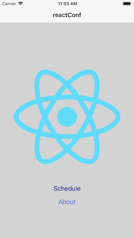

# reactConf

A dummy conference app using React Native. 

## Objective

Create a dummy conference app to play around with React Native.

## Learn

In this app, I learn about setting up the react native app, the react native language, styling, state, props, layout with flexbox, networking, and navigating between screens. 

## Result

## Conclusion

It is always fun to learn new language and to learn creating application on different platform. I spend most of the time developing application on the web using HTML, CSS, and JS on the front and using Laravel as the backend. While mobile webapp (with Service Worker) is quite good, I think users still prefer to download an app from the App store or Google play store because 1. No need to type in URL, and 2. once an app is installed, a logo is on the screen. 

In order to build a mobile app, I have to learn either Kotlin or Swift. As of today, I know neither. I chose the hybird language such as React Native to build an iOS and Android app because it is very close to the web development cycle. The best of all is that it build an app on both platform. 

I think an app that reads and writes with JSON on the network probably covers most of the app's purpose. If I need to use more native function from iOS or Android, I will need to go into detail about their respective development environment. 

With the skillset of back-end (Laravel), front-end (HTML, CSS, JS, VueJS), and mobile (React Native), I think I am in a pretty good shape if I continue to sharpen the skillset I have.